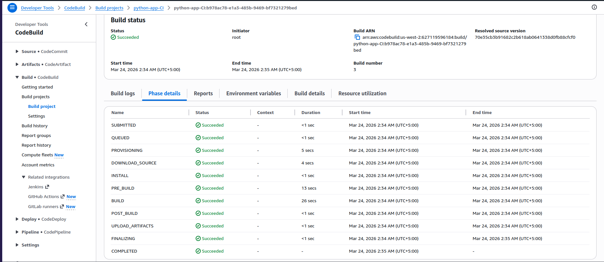
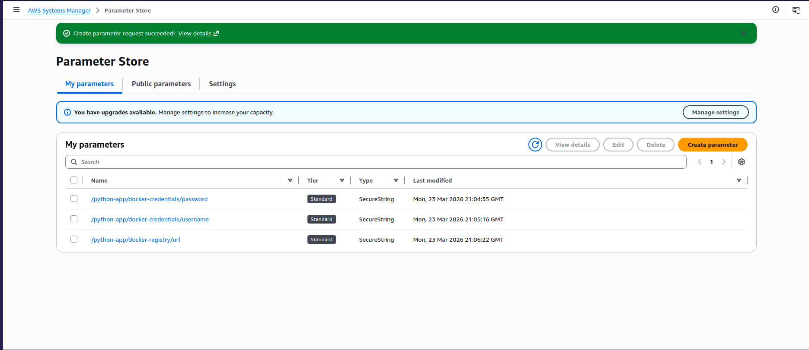
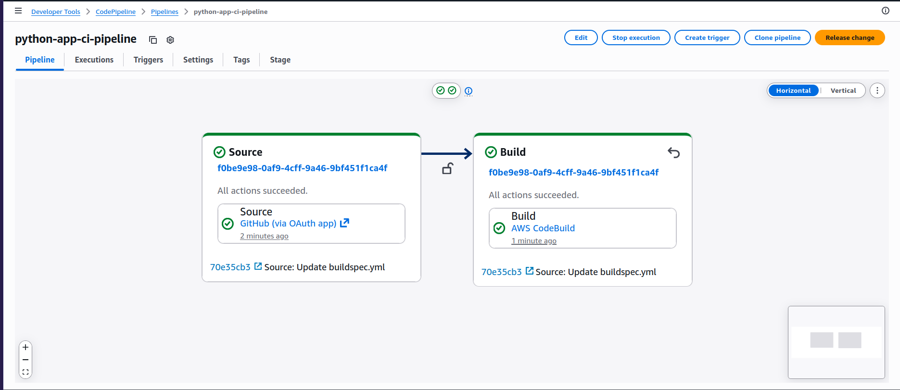

# aws ci pipeline

a continuous integration pipeline built on aws managed services. automatically builds and pushes a docker image to docker hub on every code change to the github repository.

---

## overview

this project implements the ci part of a ci/cd pipeline using:

- **github** — source code repository
- **aws codepipeline** — orchestrator that detects changes and triggers the build
- **aws codebuild** — runs the build stages defined in `buildspec.yml`
- **aws ssm parameter store** — securely stores docker credentials
- **docker hub** — stores the final docker image

---

## how it works

1. i push code to github
2. codepipeline detects the change via webhook and triggers codebuild
3. codebuild pulls the code and follows `buildspec.yml`:
   - installs python dependencies
   - logs into docker hub using credentials from ssm parameter store
   - builds the docker image
   - pushes the image to docker hub

---

## project structure

```
aws-ci-pipeline/
├── python-app/
│   ├── app.py
│   ├── Dockerfile
│   ├── requirements.txt
│   ├── buildspec.yml
│   ├── appspec.yml
│   ├── start_container.sh
│   └── stop_container.sh
└── snapshots/
```

---

## buildspec.yml

the build instructions codebuild follows:


---

## aws codebuild

build project configuration and stages:



---

## aws ssm parameter store

docker credentials stored securely:



---

## aws codepipeline

the full pipeline — source → build:



---

## docker hub

image pushed successfully after a successful build:


